# PUC-RIO-DTSC-MVP1

## Objetivo
A transição energética para fontes mais limpas é um dos desafios globais mais importantes da atualidade. O Acordo de Paris, assinado em 2015, estabeleceu metas para redução de emissões de gases de efeito estufa, promovendo uma maior adoção de energias renováveis e uma redução do consumo de combustíveis fósseis.

Este trabalho busca entender se os países estão cumprindo suas metas, quais estão se destacando na transição energética e quais enfrentam dificuldades. Além disso, será avaliado o impacto da saída ou da mudança de postura de alguns países em relação ao acordo, na política energética global.

Questionamentos:
1.	Quais países possuem o maior consumo de energia total?
2.	Quais países são mais dependentes de fontes não renováveis?
3.	Quais países possuem maior participação de fontes renováveis?
4.	Como a matriz energética de cada país evoluiu ao longo do tempo?
5.	Há padrões regionais no consumo de energia (exemplo: Europa vs América do Sul)?
6.	Quais países estão reduzindo o consumo de fontes fósseis ao longo do tempo?
7.	Os países signatários do Acordo de Paris estão reduzindo suas emissões de carbono?
8.	Quais países estão mais alinhados com as metas do Acordo de Paris?
9.	Houve impacto significativo no consumo energético de países que saíram do Acordo de Paris?
10.	A saída ou redução de compromisso de alguns países afetou o progresso global na redução de emissões?

## Coleta
### Fonte de dados

Origem dos Dados:
World Energy Statistics - Dataset “Global Data on Sustainable Energy” obtido via Kaggle.

Descrição:
Esse dataset reúne informações globais sobre energia sustentável, englobando dados como indicadores de produção, consumo, e outras métricas relevantes para a análise do setor de energia em diversos países coletados de relatórios de energia governamentais, artigos de pesquisas ambientais e pesquisas de produção de energia. Última atualização em março de 2025

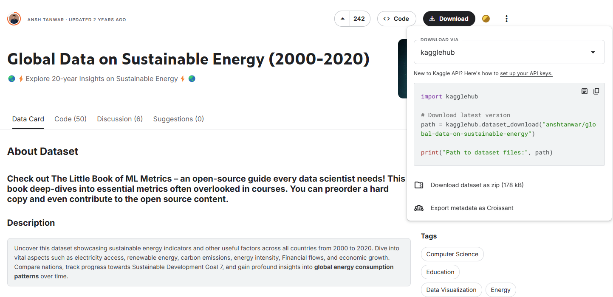

### Extração dos dados
Não foi possível fazer a extração dos dados diretamente para o ambiente do Databricks Community, sendo necessário realizar o download para a máquina e posterior upload no cluster.  A extração foi realizada via API do Kaggle integrada com Python. Foi configurado o arquivo de autenticação `kaggle.json` com as credenciais de acesso à conta do Kaggle.

Um script em Python executou o comando:

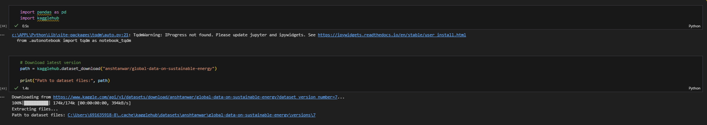

## Carga  
Inicialmente foi necessário criar o cluster no qual os dados seriam armazenados, seguindo a configuração padrão do Databrick para clusters.

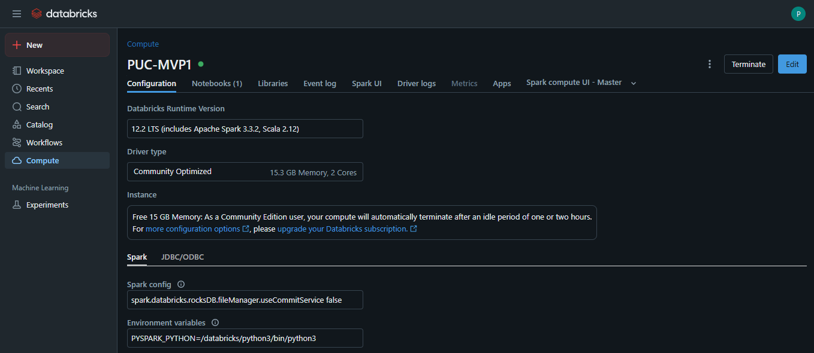

Em seguida foi realizado o full load dos dados brutos e a partir do notebook criado no momento da carga foram separadas e criadas as 3 tabelas como relatado no item **Tratamentos iniciais - Transformação**.

Persistência na Nuvem: (Databricks Community): Como o Databricks Community desativa o cluster, o dado, nesse caso NÃO é persistente, precisando ser recarregado a cada nova entrada na plataforma.

### Tratamentos iniciais - Transformação
Foram realizados tratamentos de normalização de chave da base dados, já iniciando o processo de modelagem, e inclusão de dimesões (continente, países signatários do Acordo de Paris) com base em informações obtidas no site:

https://brasilescola.uol.com.br/geografia/acordo-paris.htm#:~:text=Resumo%20sobre%20o%20Acordo%20de%20Paris,-Acordo%20de%20Paris&text=%C3%89%20ratificado%20por%20194%20partes,aumento%20de%201%2C5%20%C2%BAC.

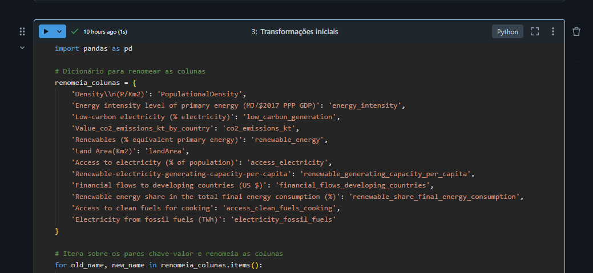

:rotating_light: O processo completo pode ser visto no Notebook [**Transformações do dado bruto**](transformacoes_do_dado_bruto.ipynb).

## Modelagem 

Foi adotada uma estrutura de modelo de dados em **Esquema Snowflake**, típica de ambientes de Data Warehouse, com o objetivo de organizar e facilitar a análise de indicadores energéticos, ambientais e econômicos por país e ano.

A modelagem segue os princípios de normalização e separação de dimensões, garantindo reuso, clareza e escalabilidade mesmo que, para esse caso, não haja nova acoplagem de dados mais recentes. 

### Componentes principais

Tabela Fato

`dados`: armazena os indicadores quantitativos por país e ano (ex: acesso à eletricidade, emissões de CO₂, crescimento do PIB, etc.)

Chave de ligação: `id_pais`

Tabelas de Dimensão

`paises`: contém atributos geográficos e demográficos de cada país (nome, localização, área, densidade, etc.), ligada à tabela fato via `id_pais`.

`continentes`: representa os continentes associados aos países, normalizada como uma dimensão da dimensão `paises`, ligada via `id_continente`

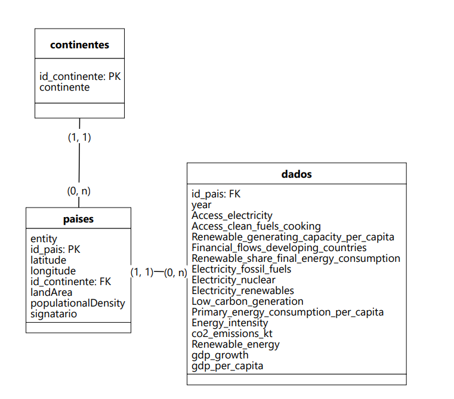

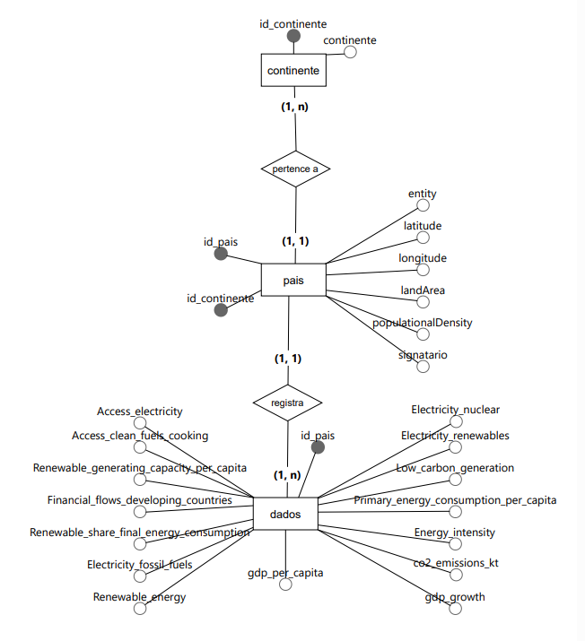

:rotating_light:[📄 Catálogo de Dados (PDF)](img/Catálogo%20de%20dados.pdf)

### Metadados
Após a carga dos dados na plataforma Databricks e as tranformações, foi realizada inserção dos metadados utilizando SQL via notebook.

## Análise 

### Qualidade dos dados

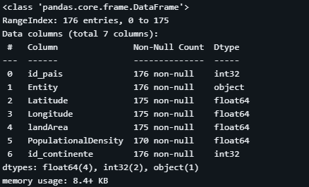

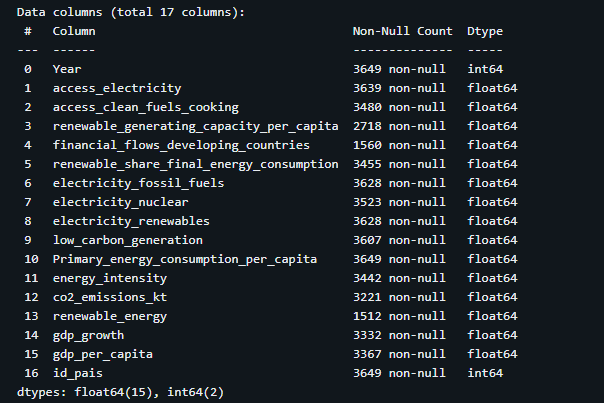

De modo geral os principais indicadores que serão utilizados na análise possuem acima de 95% dos dados não nulos. A grande ausência de dados em indicadores como `electricity_nuclear` podem indicar que certos países não reportam ou **não utilizam** energia nuclear. Já os indicadores `renewable_energy`, `financial_flows_developing_countries` e `renewable_generating_capacity_per_capita` devem ser descartados ou usados com muito cuidado e filtragem.

### Solução do problema
:rotating_light: As queries que respondem as questões podem ser consultadas no notebook  [Análise dos dados para solução do problema](Analise.ipynb)

> As métricas utilizadas nesta análise mantêm unidades distintas por razões metodológicas: a geração elétrica total está em terawatts-hora (TWh), unidade adequada à quantificação agregada nacional, enquanto o consumo per capita permanece em quilowatts-hora (kWh), que expressa o consumo médio individual com precisão.

1.`Quais países possuem o maior consumo de energia total?` 

Não há um período de análise estipulado. Logo, determinei que o recorte seria dos últimos 5 anos (2015-2020). Realizei as queries com 2 focos: o consumo total do país e o consumo dos países per capita para entender se haveria correspondência entre os mesmos.

Respondendo literalmente à questão proposta, entende-se que os países com maior consumo total refletem não apenas o tamanho de suas populações, mas também o grau de industrialização e demanda energética. Os EUA com ambos os indicadores elevados destaca-se  em ambos os quesitos. Note que a Índia,apesar de estar entre os 5 maiores consumidores, possui o mais baixo consumo per capita. 

| país           | Consumo total de eletricidade em TWh | Consumo médio per capita kWh|
|----------------|----------------------------|--------- |
| China          | 40.754,39                  |26.813,78 |
| United States  | 24.626,97                  |78.254,74 |
| India          | 8.958,35                   |6.367     |
| Japan          | 5.987,22                   |40.861,68 |
| Canada         | 3.816,42                   |108.686,58|

Entretanto, quando o foco se volta apenas para o consumo per capita, o panorama muda consideravelmente. Países com pequena população, alta renda per capita e climas extremos — como Qatar, Islândia , Emirados Árabes e Bahrain se destacam como maiores consumidores.

|país	    |Consumo médio per capita kWh|
|-----------|-----------|
|Qatar	    |211.679,29 |
|Iceland	|179.074,73 |
|Singapore	|159.826,6  |
|Bahrain	|148.473,13 |
|United Arab Emirates|	134.892,35|

A dissociação entre os rankings revela uma dinâmica importante: enquanto países como China e Índia concentram os maiores consumos totais, isso se deve majoritariamente ao tamanho populacional, e não a um alto consumo individual. Já Islândia e Emirados Árabes Unidos, embora não entrem no topo de consumo em termos absolutos, apresentam padrões de consumo individual significativamente elevados.

2.`Quais países são mais dependentes de fontes não renováveis?`

Para esse questionamento, determinei que apenas os dados do último ano registrado devem ser considerados.
Os dados revelam que, em 2020, 11 países dependiam 100% de fontes não renováveis (combustíveis fosseis e/ou nuclear).É curioso notar que sete desses, são pequenas ilhas, tanto em área quanto em população.

1. Gambia
2. Guinea-Bissau
3. Grenada
4. Djibouti
5. Kiribati
6. Nauru
7. Turkmenistan
8. Saint Lucia
9. Solomon Islands
10. Bahamas
11. Comoros

3.`Quais países possuem maior participação de fontes renováveis?`

Para esse questionamento também determino que apenas os dados do último ano registrado devem ser considerados.
Segundo os dados de 2020, apenas uma pequena parcela dos países (3,4%) alcançou a totalidade da geração elétrica por meio de fontes renováveis.

|país	    |Percentual de energia renovável na matriz|
|-----------|-----------|
|Iceland    |100% |
|Nepal	    |100% |
|Lesotho	|100% |
|Central African Republic|100% |
|Albania|100% |
|Bhutan |100% |

5.`Há padrões regionais no consumo de energia (exemplo: Europa vs América do Sul)?`

Os dados revelam padrões regionais no consumo de energia: continentes com maior PIB per capita, como Europa e América do Norte, apresentam também os maiores consumos médios de eletricidade por habitante, refletindo possivelmente infraestrutura energética avançada e alto padrão de vida. Já regiões como África e América do Sul, com menor renda, mostram consumo total e per capita significativamente mais baixos, o que indica limitações no acesso à energia e menor industrialização.

Além disso, a Europa se destaca por combinar alto consumo per capita com um consumo total menor que Ásia ou América do Norte, sugerindo maior eficiência e distribuição energética mais equilibrada. Há, portanto, uma relação direta entre desenvolvimento econômico e consumo energético, reforçando a importância da energia como vetor de desenvolvimento.

| Continente    | Consumo total de eletricidade em TWh | Consumo médio per capita kWh| PIB médio per capita US$ |
|---------------|---------------------------|--------- |--|
| Asia          | 63.124,09                 |37.368,73 |13.304,29|
| North America | 31.116,38                 |28.416,36 |21.708,35|
| Europe        | 22.091,49                 |42.181,9  |32.672,92|
| South America | 5.763,16                  |16.078,87 |8.320,56|
| Africa        | 4.615,16                  |5.564,52  |2.595,24|
| Oceania       | 1.791,09                  |22.916,69 |14.606,07|

Para fins de análise as questões 6, 7 e 8 podem ser respondidas de forma muito similar uma vez que se entende que:
- Apenas 4 países não são signatários do Acordo de Paris;
- Emissões de carbono estão intimamente ligadas a combustíveis fósseis. 

6.`Quais países estão reduzindo o consumo de fontes fósseis ao longo do tempo?`

7.`Os países signatários do Acordo de Paris estão reduzindo suas emissões de carbono??`

8.`Quais países estão mais alinhados com as metas do Acordo de Paris?`

Utilizei o Power BI para construir as visualizações, com base em dados externos, uma vez que a versão Community do Databricks não permite conexão direta com a ferramenta. A partir da medida`Taxa de emissão`, que calcula a flutuação nas emissões entre os anos de 2000 e 2019, foi possível identificar os países que apresentaram as maiores reduções no período analisado.

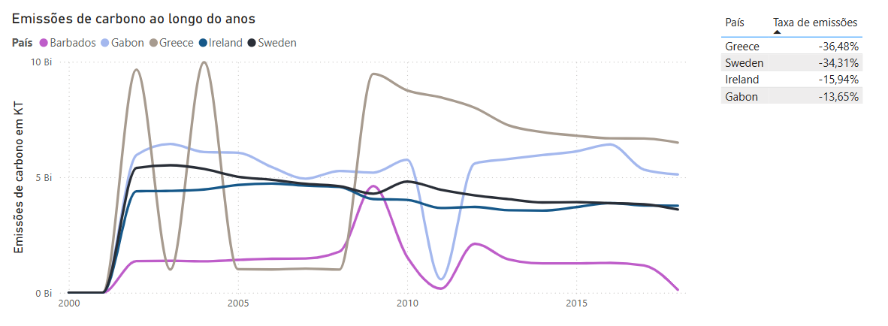

9.`Houve impacto significativo no consumo energético de países que saíram do Acordo de Paris?`

10.`A saída ou redução de compromisso de alguns países afetou o progresso global na redução de emissões?`

Não foi possível realizar uma análise mais aprofundada da questão, pois o conjunto de dados se limita ao ano de 2020. Para possibilitar uma abordagem mais específica, optei por focar no impacto da saída dos Estados Unidos do Acordo de Paris, ocorrida em 2017.

Segundo os dados disponíveis, a geração global de eletricidade a partir de combustíveis fósseis apresentava uma queda acentuada apartir do ano de  2016, seguida por um aumento em 2018 — o que pode sugerir uma possível influência dessa decisão no cenário global, ainda que os dados não permitam atribuir causalidade direta.

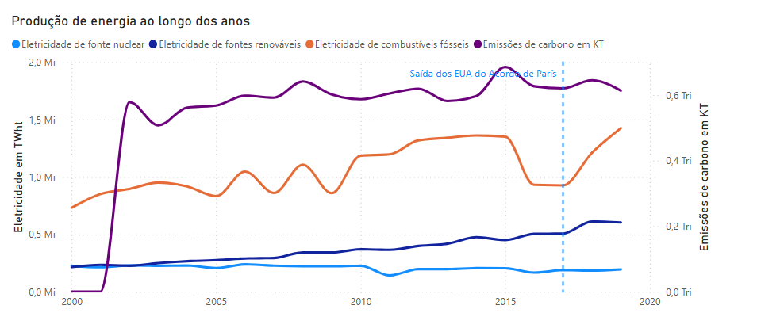

Queria também entender como diferentes partes do mundo reagiram à essa decisão.  

A segmentação por continentes revela, curiosamente, que a Ásia apresentou a maior variação relativa na geração global de eletricidade a partir de combustíveis fósseis — superando inclusive a própria América do Norte. Outros continentes não apresentam flutação negativa significativa.

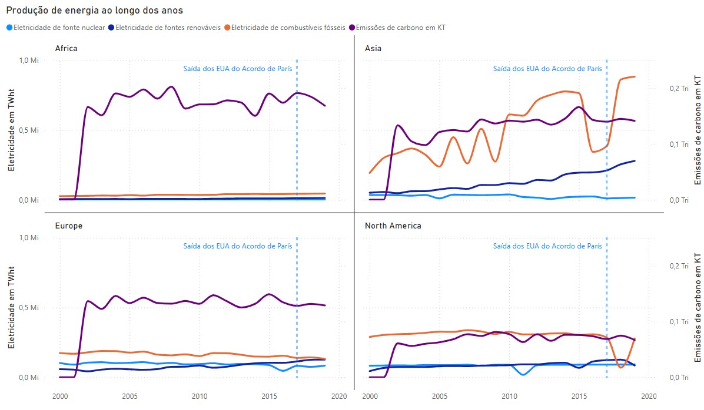

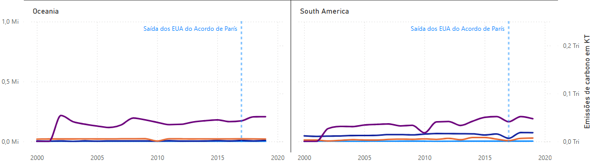

## Autoavaliação 
A seleção e análise inicial dos dados foi relativamente simples. No entanto, ao avançar para as análises em si, percebi que algumas das questões propostas careciam de recortes mais específicos e que outras eram bastante similares entre si, podendo ser respondidas por meio de uma única visualização ou apenas com segmentações distintas.

A configuração do ambiente em nuvem no Databricks foi uma das partes mais desafiadoras do processo. Enfrentei bastante retrabalho, especialmente porque o cluster criado desapareceu algumas vezes sem explicação clara. Embora tenha conseguido contornar o problema clonando os clusters desativados, o processo foi trabalhoso e repetitivo.

Inicialmente, optei por realizar as transformações externamente, utilizando Python, linguagem com a qual tenho mais familiaridade. No entanto, em determinado momento, decidi encarar o desafio de realizar as transformações diretamente no notebook do Databricks. Percebi que a execução dos códigos no ambiente Spark possui diferenças sutis, o que me levou a utilizar uma ferramenta de IA para adaptar os scripts e me familiarizar com o funcionamento do Spark. Devido a esse processo e aos vários ajustes realizados, reconheço que o registro das nomenclaturas dos atributos pode apresentar alguma inconsistência. 

Outra dificuldade foi a elaboração do Catálogo de Dados por falta de modelo e do modelo conceitual.Ao buscar exemplos na internet, encontrei muitos formatos distintos, frequentemente confundidos com dicionários de dados ou metadados. Ainda assim, procurei seguir o máximo possível as orientações apresentadas na videoaula.

## ARQUIVOS
:rotating_light: [📄 Catálogo de Dados (PDF)](img/Catálogo%20de%20dados.pdf)

:rotating_light: [Transformações do dado bruto](transformacoes_do_dado_bruto.ipynb)

:rotating_light: [Análise dos dados para solução do problema](Analise.ipynb) - Para  download esse notebook foi convertido de SQL para python.

:rotating_light: [📄 Modelo Conceitual (PDF)](Conceptualmodel_BRMW.pdf)

:rotating_light: [📄 Modelo Lógico (PDF)](Logicmodel_BRMW.pdf)
